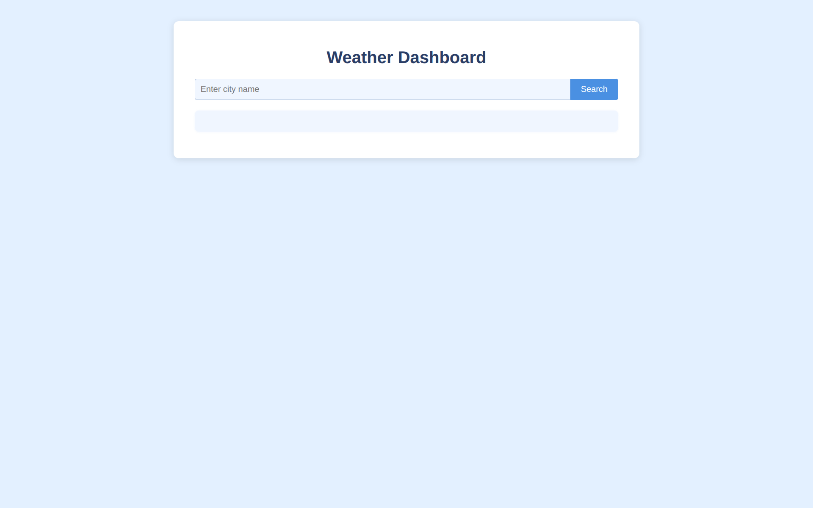
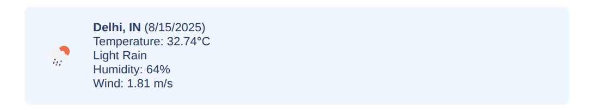
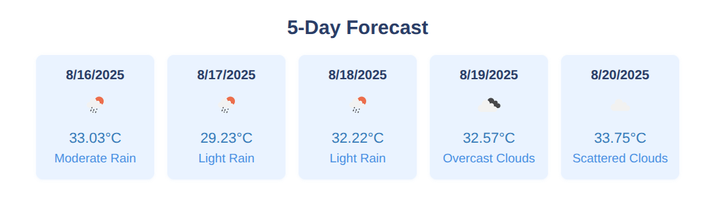
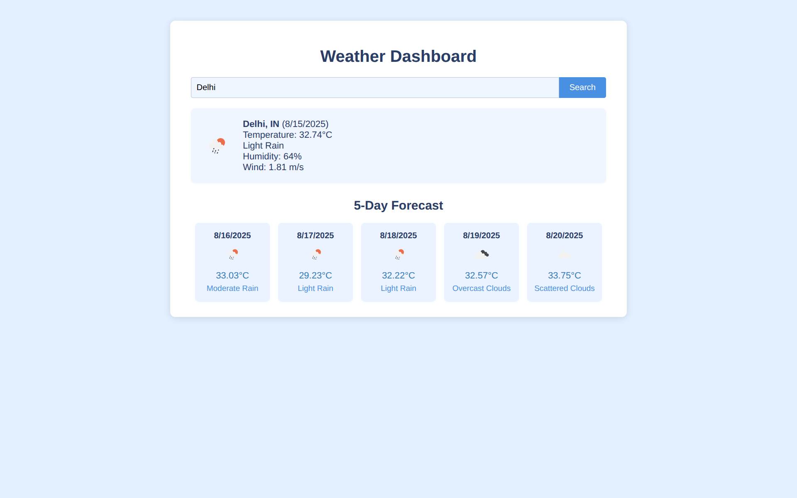

# 🌤 Weather Dashboard

A user-friendly Weather Dashboard that allows users to search for any city and view its **current weather** along with a **5-day forecast**. Powered by the OpenWeather API, the app provides real-time temperature, humidity, wind speed, and weather descriptions in an organized format.

---

## 🚀 Features

- 🔍 **Search by City** — Enter any city name to get weather updates instantly.
- 🌡 **Current Weather Details**:
  - City Name & Date
  - Temperature
  - Weather Description (e.g., cloudy, sunny)
  - Humidity
  - Wind Speed
  - Optional weather icon representing conditions
- 📅 **5-Day Weather Forecast**:
  - Date
  - Expected Temperature
  - Weather Description
  - Small weather icon (optional)
- ⚠️ **Error Handling** — Shows a friendly message if the city is not found or input is invalid.
- ⚡ **Real-time Updates** using the OpenWeather API.

---

## 🛠️ Tech Stack

- **HTML5**
- **CSS3**
- **JavaScript (ES6+)**
- **[OpenWeather API](https://openweathermap.org/api)**

---

## 📂 Project Structure

📁 weather-dashboard/
├── index.html ← Main HTML file
├── style.css ← Styling for the app
├── script.js ← JavaScript logic & API calls
├── README.md ← Project documentation
└── 📁 screenshots/ ← Screenshots used in README
├── search-city.png
├── current-weather.png
└── five-day-forecast.png


---

## 📸 Screenshots

### 🔍 City Search


### 🌡 Current Weather


### 📅 5-Day Forecast


### 🖼 Full Dashboard Overview

---

## 📦 Installation & Usage

1. **Clone the repository**:
   ```bash
   git clone https://github.com/shatrughanshukla/weather-dashboard.git
   cd weather-dashboard
